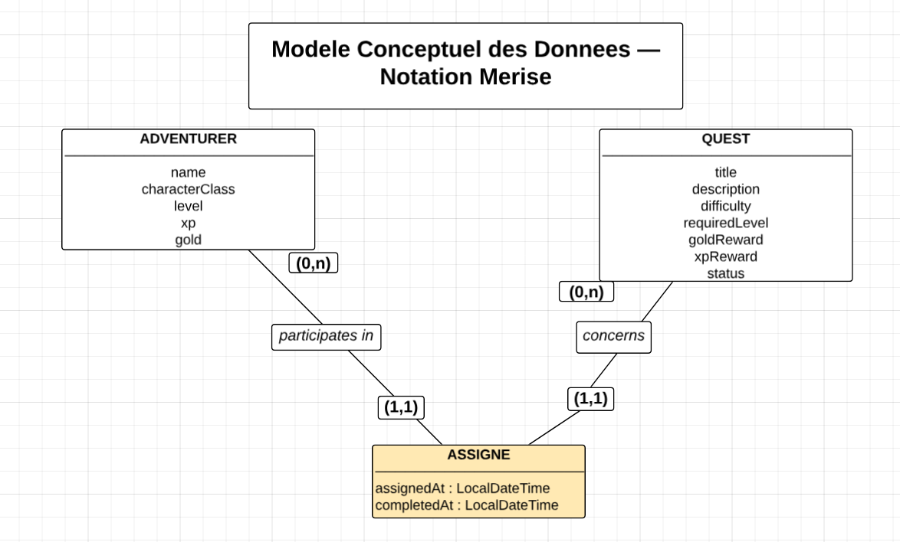
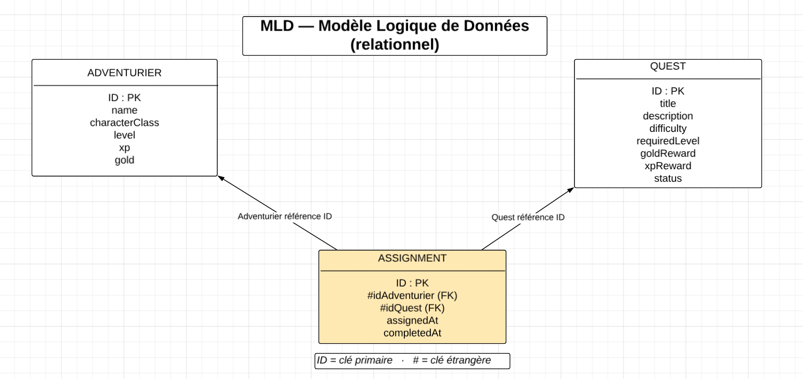
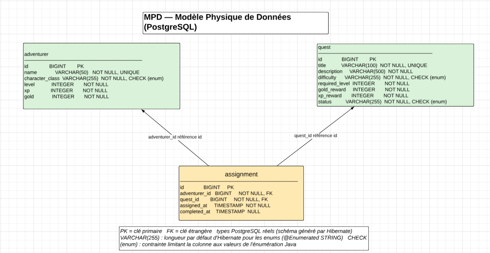

# GuildBoard

Application de gestion d'une guilde d'aventuriers, réalisée en binôme dans le cadre de la formation B2 Développeur de La Plateforme, pour le studio fictif ForgeSoft.

Une guilde reçoit des quêtes. Les aventuriers s'y assignent, les accomplissent, gagnent de l'or et de l'expérience, et montent de niveau. Le maître de guilde pilote l'ensemble depuis une interface web.

## Sommaire

1. [Présentation du projet et de l'équipe](#1-présentation-du-projet-et-de-léquipe)
2. [Prérequis et lancement pas à pas](#2-prérequis-et-lancement-pas-à-pas)
3. [Swagger UI et aperçu des endpoints](#3-swagger-ui-et-aperçu-des-endpoints)
4. [Choix techniques et difficultés rencontrées](#4-choix-techniques-et-difficultés-rencontrées)
5. [Bonus réalisés](#5-bonus-réalisés)
6. [Licence](#6-licence)

---

## 1. Présentation du projet et de l'équipe

### Fonctionnalités

- Gestion des **aventuriers** : création, consultation, modification, suppression, fiche détaillée avec jauge d'expérience et historique des quêtes.
- Gestion des **quêtes** : création, consultation avec filtres par statut et par difficulté, modification, suppression.
- **Assignation** d'un aventurier à une quête et **complétion** de la quête, avec application automatique des règles métier (niveau requis, une seule quête en cours, gain d'or et d'XP, montée de niveau).

### Stack

| Partie | Technologies |
|---|---|
| Back | Java 21, Spring Boot 4.1.1, Spring Data JPA, Bean Validation, Gradle 9.7.1, Springdoc OpenAPI |
| Base de données | PostgreSQL |
| Front | React 19, TypeScript 6 (mode `strict`), Vite 8, ESLint |
| Intégration continue | GitHub Actions |

### Équipe

| Membre | GitHub | Profil | Référent de la semaine |
|---|---|---|---|
| Samba Diop Gomis | [@samba-gomis](https://github.com/samba-gomis) | Dev Fullstack | Back-end |
| Andoniaina Njarasoa | [@Angelo-Njarasoa](https://github.com/Angelo-Njarasoa) | Dev Fullstack | Front-end |

### Structure du dépôt

```
GuildBoard/
├── backend/demo/            API Spring Boot (le nom "demo" vient de Spring Initializr)
│   └── src/main/java/com/forgesoft/guildboard/
│       ├── controller/      Endpoints REST (reçoivent, valident, délèguent)
│       ├── service/         Règles métier RG1, RG2, RG3
│       ├── repository/      Accès aux données (Spring Data JPA)
│       ├── entity/          Entités JPA (jamais exposées hors de l'application)
│       ├── dto/             Records Java servant de contrat d'entrée et de sortie
│       ├── exception/       Exceptions métier et gestion centralisée des erreurs
│       └── config/          Configuration CORS
├── frontend/                Client React + TypeScript
│   └── src/
│       ├── pages/           Écrans
│       ├── components/      Composants réutilisables
│       ├── services/        Seul endroit où sont faits les appels HTTP
│       └── types/           Types TypeScript reflétant les DTO de l'API
├── docs/                    Modèles de données Merise (MCD, MLD, MPD)
├── .github/workflows/       Intégration continue du back
├── LICENSE
└── README.md
```

---

## 2. Prérequis et lancement pas à pas

### Prérequis

- **Git**
- **PostgreSQL** 16 ou plus récent (version 16 utilisée en intégration continue, version 18 en développement local), avec un accès `localhost:5432`.
- **Un JDK 17 ou plus récent**, uniquement pour démarrer Gradle. Le JDK 21 nécessaire à la compilation et à l'exécution est **téléchargé automatiquement par Gradle** au premier lancement (une connexion internet est donc requise ce jour-là).
- **Node.js** et **npm** (testé avec Node 24.15.0 et npm 11.12.1).

### Étape 1 : la base de données

Créer la base (une seule fois) :

```sql
CREATE DATABASE guildboard;
```

L'application se connecte à `jdbc:postgresql://localhost:5432/guildboard` avec l'utilisateur `postgres`. **Le mot de passe est lu dans la variable d'environnement `DB_PASSWORD`**, qu'il faut définir avant de lancer le back :

```powershell
# Windows PowerShell (session courante)
$env:DB_PASSWORD = "votre_mot_de_passe"
```

```bash
# Linux / macOS
export DB_PASSWORD="votre_mot_de_passe"
```

Les tables sont créées automatiquement au premier démarrage (`spring.jpa.hibernate.ddl-auto=update`).

### Étape 2 : le back

```bash
cd backend/demo
./gradlew bootRun          # Linux / macOS
.\gradlew.bat bootRun      # Windows PowerShell
```

L'API est disponible sur `http://localhost:8080` dès que le message `Started DemoApplication` apparaît. Le premier lancement est plus long (téléchargement du JDK 21 et des dépendances).

### Étape 3 : le front

Dans un second terminal :

```bash
cd frontend
npm install
npm run dev
```

Ouvrir ensuite `http://localhost:5173`. Le back doit être démarré, sinon les pages restent sans données.

### Points d'attention

- Le back n'autorise (CORS) que l'origine `http://localhost:5173`. Si Vite démarre sur un autre port, adapter `backend/demo/src/main/java/com/forgesoft/guildboard/config/WebConfig.java`.
- L'URL de l'API (`http://localhost:8080/api`) est écrite en dur dans `frontend/src/services/httpClient.ts`.
- Vérifications côté front : `npm run lint` (ESLint) et `npm run build` (compilation TypeScript puis build Vite).

---

## 3. Swagger UI et aperçu des endpoints

Une fois le back démarré :

- **Swagger UI** : <http://localhost:8080/swagger-ui.html>
- Spécification OpenAPI : <http://localhost:8080/v3/api-docs>

Swagger UI permet d'essayer chaque route directement depuis le navigateur.

### Endpoints

| Méthode | Route | Description | Succès |
|---|---|---|---|
| GET | `/api/adventurers` | Liste des aventuriers | 200 |
| GET | `/api/adventurers/{id}` | Détail d'un aventurier | 200 |
| POST | `/api/adventurers` | Création | 201 |
| PUT | `/api/adventurers/{id}` | Modification | 200 |
| DELETE | `/api/adventurers/{id}` | Suppression | 204 |
| GET | `/api/adventurers/{id}/history` | Assignations passées et en cours | 200 |
| GET | `/api/quests` | Liste des quêtes, filtrable par `?status=` et `?difficulty=` | 200 |
| GET | `/api/quests/{id}` | Détail d'une quête | 200 |
| POST | `/api/quests` | Création (statut `AVAILABLE`) | 201 |
| PUT | `/api/quests/{id}` | Modification (interdite si `ON_GOING` ou `COMPLETED`) | 200 |
| DELETE | `/api/quests/{id}` | Suppression (interdite si `ON_GOING`) | 204 |
| POST | `/api/quests/{id}/assignment` | Assigne un aventurier (`{"adventurerId": 1}`) | 200 |
| POST | `/api/quests/{id}/completion` | Termine la quête et crédite l'aventurier | 200 |

### Règles métier

Elles vivent uniquement dans la couche service (`QuestService`).

- **RG1, niveau requis** : un aventurier ne peut prendre une quête que si son niveau est supérieur ou égal au niveau requis.
- **RG2, une quête à la fois** : un aventurier ne peut avoir qu'une seule quête `ON_GOING`, et une quête `ON_GOING` ou `COMPLETED` ne peut pas être assignée.
- **RG3, complétion et montée de niveau** : terminer une quête crédite l'or et l'XP, passe la quête en `COMPLETED` et renseigne `completedAt`. Tant que `xp >= niveau x 100`, l'aventurier perd `niveau x 100` XP et gagne un niveau.

### Contrat d'erreur

Toutes les erreurs ont le même format. Les **codes sont en anglais**, les **messages en français**, et aucune stack trace n'est jamais renvoyée au client.

```json
{
  "status": 422,
  "code": "LEVEL_TOO_LOW",
  "message": "Grimbold (niveau 1) ne peut pas prendre une quête de niveau 5."
}
```

| Statut | Signification | Codes |
|---|---|---|
| 400 | Données d'entrée invalides (Bean Validation) | `VALIDATION_ERROR` |
| 404 | Ressource introuvable | `RESOURCE_NOT_FOUND` |
| 422 | Règle métier violée | `LEVEL_TOO_LOW`, `QUEST_NOT_AVAILABLE`, `ADVENTURER_ALREADY_BUSY`, `QUEST_NOT_ON_GOING`, `QUEST_UPDATE_FORBIDDEN`, `QUEST_DELETE_FORBIDDEN`, `NAME_ALREADY_TAKEN`, `TITLE_ALREADY_TAKEN` |
| 500 | Erreur inattendue (message générique) | `INTERNAL_ERROR` |

---

## 4. Choix techniques et difficultés rencontrées

### Modélisation des données

Le modèle comporte trois entités : `Adventurer`, `Quest` et `Assignment`, cette dernière matérialisant l'association entre un aventurier et une quête, avec ses dates d'assignation et de complétion. Un aventurier peut avoir zéro ou plusieurs assignations, et chaque assignation concerne exactement un aventurier et une quête. Les trois niveaux de modélisation sont dans le dossier [`docs/`](docs/).

**MCD** (modèle conceptuel, notation Merise)



**MLD** (modèle logique relationnel)



**MPD** (modèle physique PostgreSQL)



### Choix techniques

- **Architecture en couches stricte** (Controller / Service / Repository) avec injection par constructeur. Les controllers ne contiennent aucune logique métier.
- **DTO en `record` Java** en entrée et en sortie : les entités JPA ne sortent jamais de l'application. Pas de Lombok, tous les accesseurs sont écrits à la main.
- **Gestion d'erreurs centralisée** dans un `@RestControllerAdvice`, avec deux exceptions métier (`ResourceNotFoundException`, `BusinessRuleException` qui porte son code).
- **Assignation et complétion dans `QuestService`** plutôt que dans un service dédié : les routes sont sous `/api/quests/{id}/...`, ce regroupement suit le découpage de l'API.
- **Un même DTO pour la création et la modification** (`POST` et `PUT`), les champs étant identiques. La règle « modification interdite si la quête est en cours ou terminée » est une vérification du service, pas une affaire de DTO.
- **Nom ou titre déjà pris renvoie un 422** (règle métier) plutôt qu'un 400 : ce n'est pas une erreur de format de la donnée.
- **Front** : TypeScript en mode `strict` sans aucun `any`, appels HTTP uniquement dans `src/services` (via un petit wrapper autour de `fetch` qui relance tel quel le corps d'erreur du back, pour afficher son message français), pas de gestion d'état externe (`useState` / `useEffect`), navigation par simple état React sans bibliothèque de routing, chaque appel réseau gère les états chargement, erreur, données et liste vide.
- **Workflow Git** : une branche par sujet, Pull Request, merge sur `main`, messages au format Conventional Commits.
- **Intégration continue** : un workflow GitHub Actions compile le back et lance le test de chargement du contexte Spring contre un vrai PostgreSQL 16 lancé comme service du job. Pour lancer les tests en local (`./gradlew test`), la base et `DB_PASSWORD` doivent donc être disponibles.

### Difficultés rencontrées

- **Exemple du sujet incohérent pour RG3** : avec la formule énoncée, un aventurier de niveau 1 à 0 XP qui gagne 250 XP finit **niveau 2 avec 150 XP** (250 - 100), alors que l'exemple annonce 50 XP. Nous avons implémenté la formule telle qu'elle est écrite et vérifié le résultat à la main via Swagger.
- **Version de Java** : aucun JDK 21 n'était installé alors que le sujet l'impose. Nous avons configuré la toolchain Gradle et le plugin Foojay pour le télécharger automatiquement. La version 0.8.0 du plugin est incompatible avec Gradle 9 (`JvmVendorSpec.IBM_SEMERU` supprimé), il a fallu passer en 1.0.0.
- **Spring Framework 7** : `HttpStatus.UNPROCESSABLE_ENTITY` est déprécié au profit de `UNPROCESSABLE_CONTENT` (même code 422).
- **CORS** : le front (port 5173) et l'API (port 8080) sont deux origines différentes, le navigateur bloquait les appels tant que le back ne l'autorisait pas explicitement. Swagger, servi par le back lui-même, ne montrait pas le problème.
- **Règle ESLint React 19** : `react-hooks/set-state-in-effect` interdit d'appeler directement un `setState` dans un `useEffect`. Les chargements de données ont été restructurés pour ne mettre à jour l'état que dans les callbacks des promesses.
- **Mémoire de la machine de développement (8 Go)** : plantages répétés de la JVM (démon Gradle, serveur de langage Java de l'éditeur). Les réglages mémoire de Gradle sont dans `backend/demo/gradle.properties`.

### Limites connues

- Pas de jeu de données de démonstration fourni : les aventuriers et les quêtes se créent depuis l'interface ou Swagger.
- L'interface ne propose pas encore la modification ni la suppression d'une quête, ni la suppression d'un aventurier (les routes et les services du front existent).
- Supprimer un aventurier qui a un historique d'assignations n'est pas géré explicitement : la contrainte de clé étrangère peut faire échouer la suppression avec une erreur générique.
- L'interface est volontairement sobre, le style n'étant pas le cœur de l'évaluation.

---

## 5. Bonus réalisés

Aucun bonus n'a été réalisé (marché de la guilde, dashboard, login) : la priorité a été donnée à la finition du socle obligatoire.

---

## 6. Licence

Ce projet est publié sous une licence **dérivée de la licence MIT avec des restrictions supplémentaires** (usage non commercial, pas d'usage du nom du projet ou des auteurs pour promouvoir un produit dérivé, pas de soumission du code comme travail personnel dans un cadre d'évaluation). Ce n'est donc pas la licence MIT standard. Voir le fichier [LICENSE](LICENSE).
